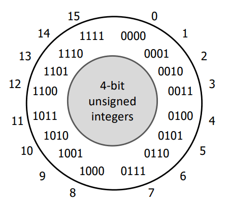
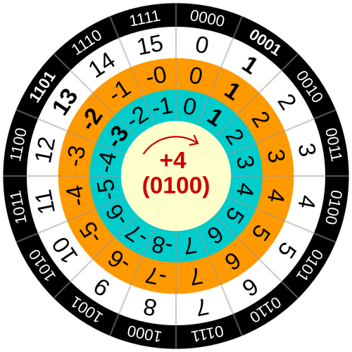

## Представяне на целочислени типове

Най-важното нещо, което компютърът трябва да може да прави е да борави с числа - да ги събира, изважда, умножава и дели. За тази цел трябва да се определи начин, по който тези числа да се представят в хардуера. В този урок ще си изясним точно това - как се представят целите числа в компютъра.

`С цел улеснение на записа, ще работи с 4 битови числа в предела на записките!`

## Числа без знак (Unsigned)

След като знаем какво е двоичната бройна система и как работи, вече интуитивно можем да си представим как биха изглеждали числата без знак. Това ще са просто двоичните стойности [0,15], тъй като имаме 4 бита на разположение. 

Общата формула за количеството числа без знак, които можем да представим по този начин е: `2^(bits) - 1`.

</img>

**Overflow и Underflow**

Какво обаче се случва ако преминем отвъд 15 или под 0? Според официалния стандарт на езика **C** при преминаване отвъд или под стойностите на число без знак (unsigned) стойноста циклично се превърта. Ако минем под 0 отиваме на 15, ако минем над 15 отивамае на 0.

Тук правилата са строго и ясно определени!

## Аритметични операции с числа без знак

Събиране

--- 

**Правила за смятане**

|   А   |   Б   | Резултат |
| :---: | :---: |  :---:  |
|    1  |   0   |    $1$    |
|    0  |   0   |    $0$    |
|    1  |   1   |    $0$    | 
|    0  |   1   |    $1$    |

----

**Правила за вземане на ум (carry)**

|   A   |   B   | Резултат|
| :---:     | :---:      |  :---:  |
|    1      |   0        |    $0$   |
|    0      |   0        |    $0$   | 
|    1      |   1        |    $1$   | 
|    0      |   1        |    $0$   |

----

В случая на `1+1` резултатър се занулява и взимаме едно на ум или на английски "carry". Ще илюстрирам събирането чрез няколко прости примера:

~~~
  _
1010 (10)
   +
0010 (2)
----
1100 (12)

---------------------------------------------
 ___
0101 (5)
   +
0111 (7)
----
1100 (12)

Разяснение: 
1 + 1 = 0 и едно на ум
0 + 1 = 1 + 1 (carry) = 0 и едно на ум
1 + 1 = 0 + 1 (carry) = 1 и едно на ум
0 + 0 = 0 + 1 (carry) = 1 
~~~

----

**Допълнение - логическо И(&) и изключващи или (XOR)**

|   А   |   Б   | Резултат & | Резултат XOR |
| :---: | :---: |  :---:     | :------:     |
|    1  |   0   |    $1$     |      1       |
|    0  |   0   |    $0$     |      0       |
|    1  |   1   |    $0$     |      0       |
|    0  |   1   |    $1$     |      1       |

Ако сте внимателни можете да видите как **изключващото или** има абсолютно същата таблица на истинност като тази на събирането и как **логическото И** има абсолютно същата таблица като тази за взимане на ум (carry). 

Това не е случайно, на харудерно ниво за да се пресметнат две числа са нужни само тези две операции и нищо друго!

Умножение

---
  
**Правила за умножение**

|   A   |   B   | Резултат|
| :---:     | :---:      |  :---:  |
|    1      |   0        |    $0$   |
|    0      |   0        |    $0$   | 
|    1      |   1        |    $1$   | 
|    0      |   1        |    $0$   |

Стъпки на умножение:

1) Вземаме всяка цифра на множителя (второто число) от дясно на ляво. Ако е единици копираме първото число, ако е нула пишем ред от нули
   
2) Правим отстъп от една позиция наляво и се връщаме на стъпка 1. ако числото не е свършило, иначе отиваме на стъпка 3.
   
3) Събираме всеки написан ред.

Нека разгледаме няколко примера за умножение:

~~~
   0101 (5)
      *
   0010 (2)
   ----
   0000
  0101.
 0000.
0000.
------- +
0001010 (10)

---------------------------------------------

   0010 (2)
      *
   1101 (-3)
   ----
   0010
  0000.
 0010.
0010.
------- +
0011010 (изрязваме прелятата част)
= 
0001010 = -6
~~~

## Числа със знак (Signed)

Сега искаме да добавим и знак към нашите числа. Как можем да постигнем това?

На първо място можем да се досетим, че с всеки бит в репрезентацията, числото ни побира **2x** повече данни. В нашата 4 битова репрезентация числата с вдигнат последен бит са 8 на брой - [8,15], колкото са и числата без повдигнат последен бит - [0,7]. Следователно ще използваме числата с вдигнат последен бит за отрицателни. 

Така последният бит служи като указател за знака на числото и диапазонът на стойностите естествено намалява **два пъти**!

| Положителни числа | Отрицателни числа | 
| :---------------: | :---------------: | 
|    0000           |   1111             |   
|    0001           |   1110             |   
|    0010           |   1101             |  
|    0011           |   1100             |   
|    0100           |   1011             |   
|    0101           |   1010             |   
|    0110           |   1001             |   
|    0111           |   1000             |   

Имаме отрицателните числа, обаче сега как знаем кое отрицателно число на кое съответсва? На този въпрос има два отговора...

### One's compliment

Първоначалната идея за намиране на обратното на едно число се нарична **One's compliment** и се е използвала през 60-те години на миналия век. Нейната идея е, че за да намерим обратното на едно число, ще вземем най-голямото възможно число 2^(bits), и от него ще извадим нашето число. Числото, което получаваме се нарича комплимент, тъй като ако го съберем с първото получаваме само единици (от там и името).

Обаче имаме един проблем, не можем да представим 2^(bits) като число, тъй като не ни стига прецизност. За наше щастие не е нужно да правим истинско изваждане, тъй като ако обърнем всеки един бит в представянето на числото постигаме същия ефект. 

Операцията, която обръща всеки един бит в число се нарича **logical not** или логическо отрицание на български. Тя има следната табличка на истинност:

| Вход  | Изход | 
| :---: | :---: | 
|    1  |   0   |
|    0  |   1   |

---

Можете да видите, че не ви лъжа:
~~~
Търсим комплимент на 0101 (5)
----------------------------------------------------
Намриаме комплимента: 2^(bits) - 0101
10000
    -
 0101
-----
01010 => 10

Събираме двете числа и очакваме само единици
----------------------------------------------------
0101
   +
1010
----
1111 => само единици, значи 1010 е комплимент

----------------------------------------------------
Нека приложим логическо отрицание: ~(0101) = 1010
Получихме отново същия резултат!
~~~

**Проблеми**

Този метод има два съществени проблема:

* **Имаме две нули** - нужна е хардуерна логика, която да разграничава положителната от отрицателната нула.
  
* **Не можем да използваме аритметичната логика за числа без знак**.

Ще илюстрирам проблема с пример:
~~~
Събираме 6 с -2
---------------
0110
   +
1101 (~0010)
----
0011 = 3, което не е вярно!
~~~

### Two's compliment

Идеята на **Two's compliment** наподобява изключително много тази на **One's compliment**, само че тук не очаквайте да получите навсякъде двойки! Името произхожда от това, че за едно число A, ако го съберем с комплимента му B, то получаваме 2^(bits). 

С прости думи - ако съберем число и обратното му получаваме overflow и резултатът се занулява до 0000, тъй като 2^(bits) не се побира в представянето.

**Как намираме комплимента?**

Вече видяхме, че ако имаме едно число A и го съберем с комплимента му спрямо единицата, то получаваме най-голямото възможно число, което е на точно 1 бит от преливането, това на какво ни навежда? 

... (Помислете малко!)

Ще добавим 1... Това е единствената нова разлика, просто добавяме единица след като обърнем битовете на числото и гарантирано след сумация ще получим overflow.

Нека видим дали нашия стар пример работи с този подход:
~~~
Събираме 6 с -2
---------------
0110
   +
1110 (~0010 + 1 = 1101 + 1 = 1110)
----
0100 = 4, huge success :D
~~~

---

**Проблеми!**

Този подход има един единствен проблем и това е, че получаваме една допълнителна цифра. Тъй като нямаме две нули имаме 15 на брой числа. 

Допълнителната цифра може да се сложи както при положителните така и при отрицателните числа. В C-like езици, тя е при отрицателните и се нарича most negative number. Тази цифра няма обратна, ако опитате да направите abs(-8), това е недефинирано и не се знае изхода, тъй като няма съответствие при положителните числа.

В следното изображение можете да видите, че most negative number е -8.

</img>

One's compliment - оранжево, Two's compliment - синьо

----

## Допълнение - конвертиране на отрицателни числа от двоична в десетична БС

Подходът на конвертиране на отрицателни числа е почти същия като положителните, с изключението на това, че ако най-значимият бит, който отговаря за знака е вдигнат, то него вземаме с отрицателен знак.

Илюстрирам с пример:
~~~
Конвертираме 1010 от двоична в десетична:
---------------------------------------------------- 
2^3*(-1) + 2^2*0 + 2^1*1 + 2^0*0 = -8 + 0 + 2 + 0 = -6

Конвертираме 1111 от двоична в десетична:
---------------------------------------------------- 
2^3*(-1) + 2^2*1 + 2^1*1 + 2^0*1 = -8 + 4 + 2 + 1 = -1
~~~
