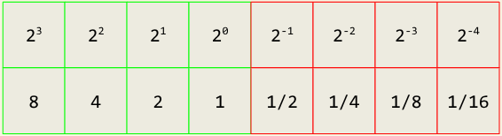
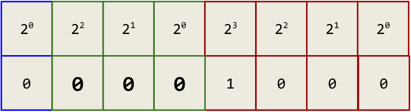

## Числа с фиксирана запетая (Fixed point numbers)

Първият и най-лесен начин да си представим реалните числа е като добавим дробна част. За цел на демонстрацията тя ще бъде с непроменлив размер.

Като пример ще разгледаме 8 битово число:

* **4 бита** - цяла част.
* **4 бита** - дробната част.

  </img>

---

Първите четири бита служат за представяне на 4 битово цяло число без знак, следователно можем да представим числата в интервала [0,15]. Следващите 4 бита ни служат за представяне на дробната част на числото. Всеки бит в нея индикира конкретно реално число със стъпка 1/2. 

Крайната дроб изчисляваме като сумата от всички вдигнати битове:

~~~
Цяла част | Дробна част
          |
0000      | 1000 = 0.5     (1/2)
0000      | 0100 = 0.25    (1/4)
0000      | 0010 = 0.125   (1/8)
0000      | 1000 = 0.0625  (1/16)
0000      | 1111 = 0.9375  (1/2 + 1/4 + 1/8 + 1/16)
~~~

**Аритметични операции**

Много хубавото качество на числата с фиксирана запетая е, че всяка от изучените аритметични операции върху цели числа остава в ефект без нужда от промяна по логиката. 

Ето няколко примера за събиране и умножение:

~~~
Пример 1:
--------------------------------------------------
1010|1000 (10.5)
          +
0001|0000 (1)
----------
1011|1000 (11.5)

Пример 2:
--------------------------------------------------
1011|1010 (11.625)
          +
0001|0101 (1.3125)
----------
1100|1011 (12.4375)

Пример 3:
--------------------------------------------------
1011|1000 (11.5)
          +
0001|1000 (1.5)
----------
1101|0000 (13)

Пример 4:
--------------------------------------------------
  0001|1000 (1.5)
          *
  0001|1000 (1.5)
  ----------
  00000000
 00011000 +
000110000
------------
00100100 (2.5)
~~~

**Ползи от числата с фиксирана запетая**

* Числата са симетрично разположени около "точката".
* Всички стойности са разпределени равномерно по числовата ос, няма "дупки" между стойностите.
* Преизползва се вече съществуващата логика за аритметика за целите числа.

Числата с фиксирана запетая фигурират при малки компютърни системи, по-конкретно в **embedded** света, тъй като с тях се работи много лесно и не нужен допълнителен компонент за пресмятането им на ниво силикон (CPU). Ако ви е интересно можете да прочете за [Q](https://en.wikipedia.org/wiki/Q_(number_format)) числовия формат.

## Числа с плаваща запетая (Floating point numbers)

Числата с плаваща запетая следват изцяло други правила, коренно разграничаващи се с досегашните ни познания. Като за начало те са подравнени в ляво, към първия значим бит (most sufficient bit). 

Това се прави поради една много интересна причина, нека разгледаме числото: $...000|10.1001|000...$

Както знаем, всяко двоично число, различно от $0$ има най-значим бит единица, следователно като досетливи програмисти, които искат да спестят място за повече числа, ние ще се престорим, че тази единици винаги я има и ще я игнорираме. Така числото ни става:

$$...000(X)|0.1.1001|000...$$

`Сега ако се чудите как бихме разграничили нулата ще ви кажа браво за въпроса, но до отговорът ще стигнем след малко, тъй като не е интуитивен!`

## Представяне

За да представим едно 8 битово число с плаваща запетая ще ни трябва следното:

* **1 бит** - знак {0,1}
* **3 бита** - експонентата [0,7]
* **4 бита** - мантисата [0,15]

  </img>

---

Крайното число се изчислява по формулата.

$$\text{value} = (-1)^{\text{sign bit}} \cdot 2^{\text{exponent}} \cdot 1.\text{mantissa}$$

## Signed Exponent

При числата с плаваща запетая експонентата трябва да може да бъде както положителна така и отрицателна. Това обаче не се случва чрез познатия ни вече метод **Two's compliment**, а посредством **"biased"** (отместено) представяне. При него към експонентата ще добавим **-3** и така неиният диапазон на стойности се превръща в [-3,4]. 

Идеята да имаме по-голяма положителна част е за да не прелее $1/2^{-3}$, тъй като по-често числата преливат отгоре, отколото отдолу. Така че $1/{2^4}$ ще прелее отдолу!

Така нашата формула приема нов вид.

$$\text{value} = (-1)^{\text{sign bit}} \cdot 2^{\text{(exponent - 3)}} \cdot 1.\text{mantissa}$$

## Специални състояния 

При използване на числа с плаваща запетая разполагаме със специални знаци (състояния), в които могат да изпаднат числата при грешки в смятането или невалидни операции.

В тази табличка се помещават всички възможни състояния и кога точно се получават.

| Експонента | Мантиса | Състояние |
| :--------: | :-----: | :-------: |
|    000     |   000   |   $\pm 0$ |
|    000     |   ***   |   $0.mantissa * 2^{\text{-3}}$ |
|    111     |   000   |   $\pm inf$ |
|    111     |   ***   |   $NaN$ |

**NaN**

В ранните зори на компютрите инжинерите в IBM са се чудили какво да правят ако в програма се случи математическа операция, която не е дефинирана (не може да се случи). Примери за това са - деление на нула (0/0) или корен квадратен от отрицателно число. Тяхната идея е била програмата да спре и да се изпише грешка. Това понякога не е ОК. 

Ако програма новата ви GTA 6 спре изведнъж да работи, защото някой цвят на екрана се е изчислил до стойност разделена на нула няма да е много забавно. Затова хората решили да направят специално състояния на числата с плаваща запетая за невалидни операции на име **NaN** (Not a number). Ако NaN участва в каквато и да е аритметична операция, тя цялата ще се оцени до NaN.

В следната табличка съм илюстрирал кои операции водят до появата на NaN:

| Операция | Какво прави NaN |
| :---: | :---: |
| + | $\infty + (-\infty)$ |
| * | $0 \times \infty$ |
| / | $0/0$, $\infty/\infty$ |
| % | $x$ % $0$, $\infty$ % $x$ |
| $\sqrt{x}$ | $\sqrt{-x}$ |

**Infinity**

Безкрайността игра същата роля като NaN, обаче той сигнализира **overflow** или **underflow**. Това ни помага като не ни се върне някакъв случаен резултат число, а специално състояние индикиращо грешка.

Например във формулата `b^2 - 4ac`, ако b = 2^3*1.mantisa, при повдигане на квадрат ще прелеем и ще ни се върне $/infty$, което ще инвалидира след това получените корени! 

Много важен е също така факта, че $x / \infty = 0$, което означава че не всяка математическа операция, в която участва безкрайност ще върне безкрайност!  

**Signed Zero**

Тъй като числото има бит за знака, можем да получим две нули - както положителна нула така и отрицателна. Стойностите им са еднакви `0=-0` и това е направено умишлено. 

Като пример давам функцията логаритъм, която при $log(x)$ за x = 0 връща безкрайност, а за x < 0 е NaN (не е дефиниран). Ако имаме число x < 0, което е много малко и не може да се представи посредством битове ни, то ще се закръгли до -0 и логаритъмът ще върне NaN вместо $inf$, което е много важно!

**Денормализирани числа**

Тук ще се спра само повърхностно, тъй като темата е дълбока. Всяко число винаги започва с нула, ОСВЕН ако сме стигнали минималната експонента. Тогава се позволява числото да започне с нула и експонентата да започне да заема и мястото на мантисата, за да може да се представят много малки числа (за сметка на точността). Това се случва поради изваждането на малки числа, които влизат в диапазона на позволената мантиса, но след изваждане стават толкова малки, че не могат да се поберат. 

Ако ви е интересно можете да прочетете подробно за темата в посочените източници!

## Нормална форма 

За да можем да извършваме аритметични операции над числа с плаваща запетая ще ни е нужда някаква унифицирана форма за тяхното представяне. Точно тази форма ние ще наричаме "нормална". Всяко число (освен нулата и денормализираните числа) е в нормална форма и започва с единица.

----

~~~
Пример за нормална форма:
--------------------------------------------------
Число в двоичен запис: 0|110|0101
Експонентата е 6 - 3 = 3
Нормалният запис със скритата единица е: 1.0101

Стойността по формулата: (-1)^0 * 1.0101 * 2^3 = 1010.1
Краен резултат: 10 + 1/2 = 10.5 
~~~

----

### Пробайте сами!

**Задача 1**

На колко е равно числото: `0|011|1011`

  
Отговор

~~~
Число в двоичен запис: 0|011|1011
Експонентата е 3 - 3 = 0
Нормалният запис със скритата единица е: 1.1011

Стойността по формулата: (-1)^0 * 1.1011 * 2^0 = 1 + 1*1/2 + 0*1/4 + 1*1/8 + 1*1/16 = 1.6875
~~~

**Задача 2**

На колко е равно числото: `0|101|0000`

  
Отговор

~~~
Число в двоичен запис: 0|011|1011
Експонентата е 5 - 3 = 2
Нормалният запис със скритата единица е: 1.0

Стойността по формулата: (-1)^0 * 1.0 * 2^2 = 100(2) = 4
~~~

**Задача 3**

На колко е равно числото: `1|001|1000`

  
Отговор

~~~
Число в двоичен запис: 1|011|1011
Експонентата е 1 - 3 = -2
Нормалният запис със скритата единица е: 1.1

Стойността по формулата: (-1)^1 * 1.1 * 2^-2 = -0.011 = -(1/4 + 1/8) = - 3/8 = -0.375
~~~

## Събиране на реални числа с различни експоненти 

Нека започнем с аналогия от 5 клас. Как смятаме дроби с различни експоненти, ами докарваме ги до една и съща!

Да вземеме следния пример под ръка:

~~~
1.20 + 4.80 + 0.001                     =
120 * 10^-2 + 480 * 10 ^-2 + 1 * 10^-3  =
(1200 + 4800 + 1) * 10^-3               =
(6001) * 10^-3                          =
6.001
~~~

----

В математиката, сумата се изчислява до междинна стойност с "безкрайна" прецизност. Обаче това не е възможно в съвременните ни компютри, които са ограничени до 64 битови числа, така че винаги ще сме ограничени като стане дума за точност при пресмятане и грешката за жалост ще бъде неизбежна. Това обаче не означава, че не можем да я направим изключително малка, половин век хората са се опитвали да го направят и до голяма степен са успели. Сега ще демонстрирам повърхностно съвременните идеи за смятане.

Нека вземем следния пример:
~~~
Нека имаме следната сума:
-------------------------------------------------------
(0|001|0000 + 0|110|0000) + 0|011|0100 

Първо ще изчислим изразът в скобите
-------------------------------------------------------
0|001|0000 + 1|110|0000  = (трябва от -2 експонентата да стане 3, мърдаме 5 позиции на дясно)
0|110|00001 + 1|110|0000 = (обаче излязохме извън прагът на нашето число)
0|110|00001              =
0|110|0000 (все едно нищо не направихме Д;)

Сега изчисляваме останалата част
-------------------------------------------------------
0|110|0000 + 0|110|00101 = (след изравняване на експонентите пак излчзохме извън пределите на нашата точнот...)
0|110|00101              =
0|110|0010 = 2^0 * 1.001 * 2^3 = 1001 = 9

Изразът е: 0.25 + 8 + 1.25 = 9.5 имаме грешка от 0.5

Обаче ако направим следното:
-------------------------------------------------------
(0|001|0000 + 0|011|0100) + 0|110|0000 =
(0|011|0100 + 0|011|0100) + 0|110|0000 =
0|011|1000 + 0|110|0000                =
0|110|0011 + 0|110|0000                =
0|110|0011 = -1^0 * 1.0011 * 2^3 = 1001.1 = 9.5 (Успех!)

Една лека промяна: (1.25 + 0.25) + 8, направи сумата да е вярна?
~~~

От този пример разбрахме, че когато смятаме числа с голяма разлика в експонентите се получава загуба на точност поради приравняване. Но това е силно нежелан ефект, ако например пишем софтуер, които трябва да добавя температурни стойност през няколко минути и да ги приравни в края на деня, това ще доведе до изцяло погрешни данни и безполезен код. 

**Как да се справим с това?**

Решенията вече са взети вместо нас, в прикачените ресури най-долу можете да намерите академичен доклад от 90-те години, където ясно се показва как се сумират дробни числа на ниво процесор. Това се случва с така наречените **Guard Digits**!

## Какво са Guard Digits?

Те са три на брой допълнителни бита (**Guard**, **Round**, **Sticky**), които служат да изчислят опашката на числото, която предстои да бъде изрязъна и да го закръглят правилно. Те работят на следния принцип:

* **Round down** - ако последните три бита са < 0.5 (001, 010) тогава се изрязва числото.
  
* **Round up** - ако последните три бита са > 0.5 (101, 110) тогава на последно място (в най-малкия бит) се слага 1-ца.

* **Round even** - ако е точно 0.5 се гледа дали числото е четно и тогава се слага 1-ца иначе 0. Можете да видите причината в статията, идеята е да не се натрупва изкуствена грешка.

Този метод е доказан да докара почти неглижируема грешка за повечето операции с числа с плаваща запетая, но въпреки това при сметки с много голяма разлика, три бита уви няма да могат да ни помогна. 

При това положение имаме няколко опции:

* Да се подредят числата, така че да няма сума с огромна разлика.
* Да се използва сумата на Кахан.

# Disclaimer!

`Цялата информация в този урок, ОСВЕН представянето на числа с фиксирана и плаваща запетая няма да се изисква от вас в оценяването на курса. Тук аз подготвих материали по достъпен начин, които аз много исках да имам, когато бях първи курс. По-голямата част от студентите и хората в индустритята считат числата с плаваща запетая за табу. Така че ако съм помогнал на дори 1 човек да разбере как работи тази черна кутия, аз съм щастлив.`

## *Сума на Кахан (За любознателните)

Идеята на алгоритъма е, че се изчислява постепенно грешката, която се акумулира по време на сметките и се премахва от натрупаната сума. Така грешката се свежда по минимум!

~~~
sum = 0.0, error = 0.0

for (0..N)
    y = input[i] - error
    t = sum + y        	// sum has large exponent, y has small
    error  = (t - sum) - y // (t - sum) reduces the exponent, -y returns only least significant bits
    sum = t
~~~

## Източници 

**1. Любомир Коев (Number lecture at Chaos Camp) - [Link](https://docs.google.com/presentation/d/1QtD1R_k4bH90Gmt2zDWM7C-MVIdvJJKaUVFBJ-90acA/edit?slide=id.g104af501d60_0_607#slide=id.g104af501d60_0_607)**  

**2. What Every Computer Scientist Should Know About Floating-Point Arithmetic - [Link](https://docs.oracle.com/cd/E19957-01/806-3568/ncg_goldberg.html)**

## Други интересни източници, за който му е интересно

**Greg Walsh** - [Fats inverse square root](https://en.wikipedia.org/wiki/Fast_inverse_square_root)

**Сайт за визуализация на числа според IEEE 754 стандарта** - [Link](https://float.exposed/0x41200000)
